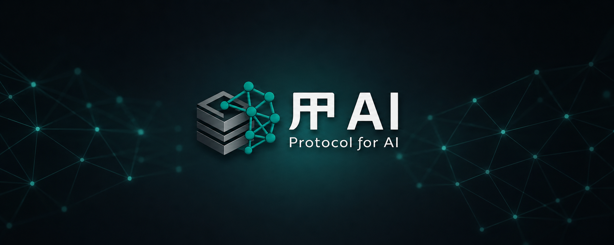

# PAI - Protocol for AI

## Overview
---
PAI (Protocol for AI) is a next-generation communication and coordination protocol designed for autonomous AI agents, intelligent systems, and machine-driven ecosystems.

The protocol enables AI agents to securely discover, communicate, negotiate, collaborate, and execute tasks across distributed environments without human intervention. PAI aims to establish a standardized infrastructure layer for the emerging AI-native internet — where software agents operate as independent digital entities capable of interacting with other agents, services, APIs, compute providers, and marketplaces in real time.

PAI provides a foundation for:

- Agent-to-agent communication
- Capability discovery and task delegation
- Autonomous workflow orchestration
- Secure identity and authentication
- Inter-agent trust and reputation systems
- Resource and compute allocation
- AI-native economic transactions
- Distributed multi-agent collaboration

Inspired by foundational internet protocols such as TCP/IP and HTTP, PAI is built to become a universal interoperability layer for intelligent systems. The protocol is framework-agnostic, scalable, modular, and designed for enterprise-grade reliability across cloud, edge, and decentralized infrastructures.

As AI evolves from isolated assistants into autonomous digital workers, PAI serves as the backbone for enabling coordinated intelligence at internet scale.

## Getting Started
---

## Project Structure
---

## Contributing
---
We welcome contributions of all kinds! Whether you want to fix bugs, improve documentation, or propose new features, please see our [contributing guide](./profile/CONTRIBUTING.md) to get started.

Have questions? Join the discussion in our [community forum](https://www.github.com/PAI-Protocol-for-AI/discussions).

## About
---
PAI is an open-source project hosted by [ARL Matrix](https://www.linkedin.com/company/arlmatrix/) and open to contributions from entire community.
Thank you very much!
